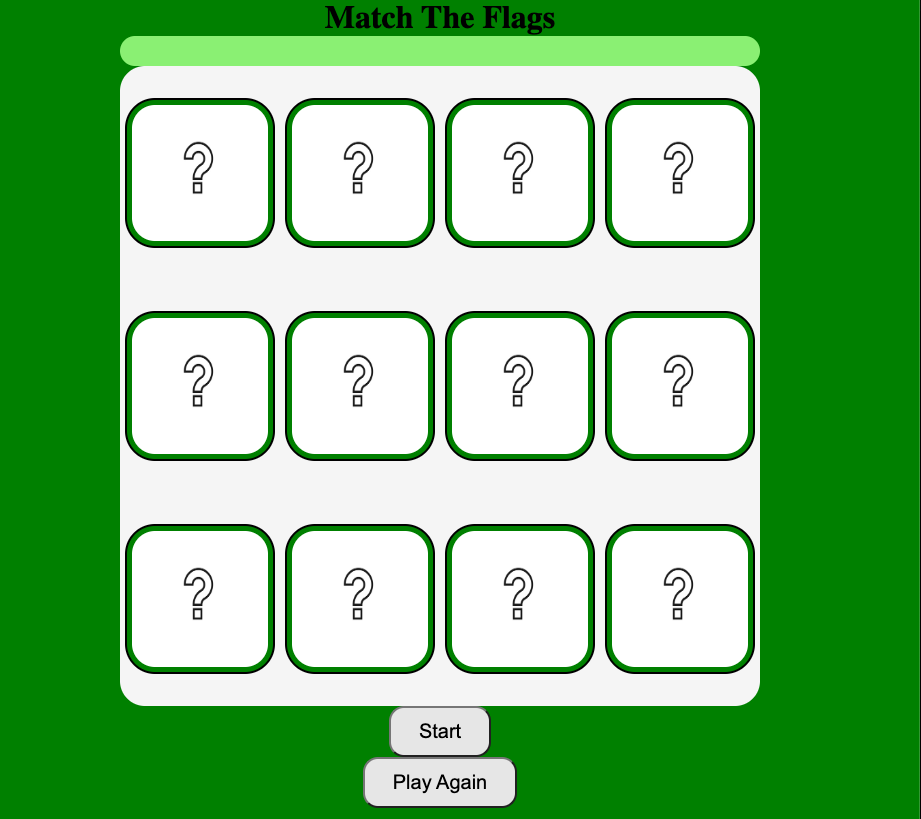
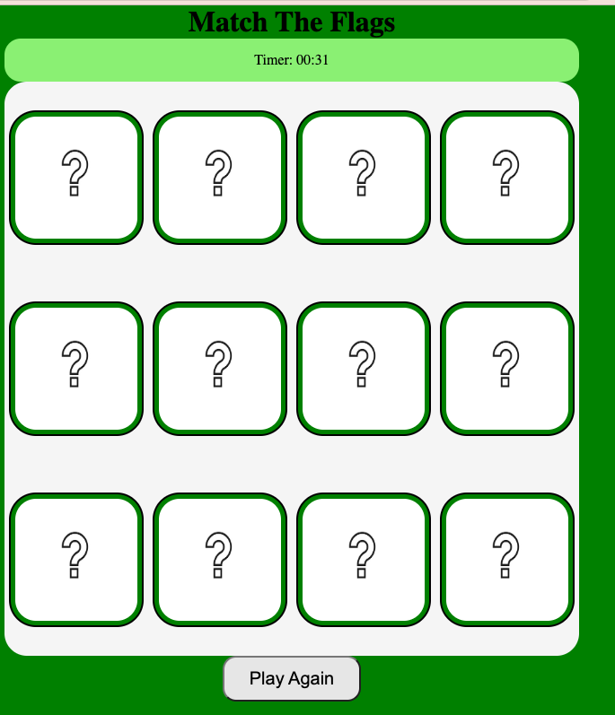
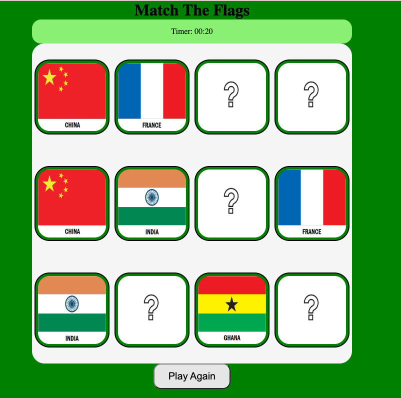
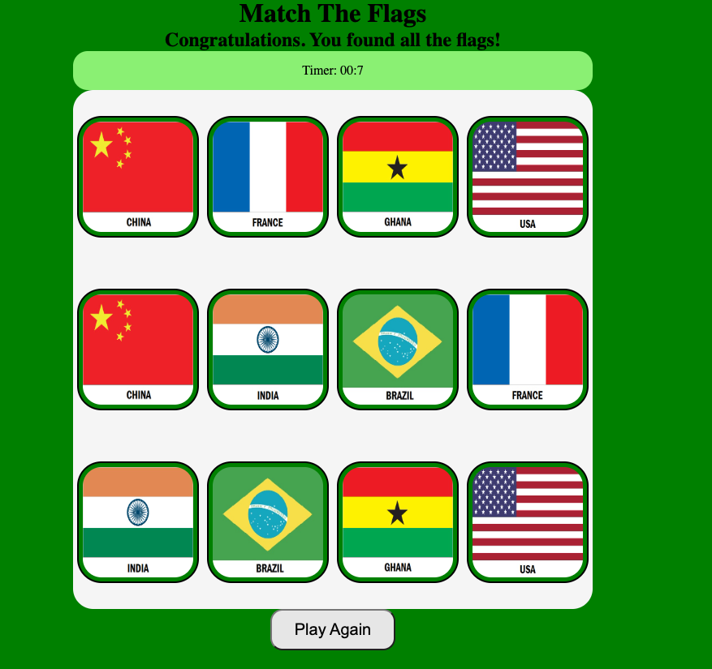
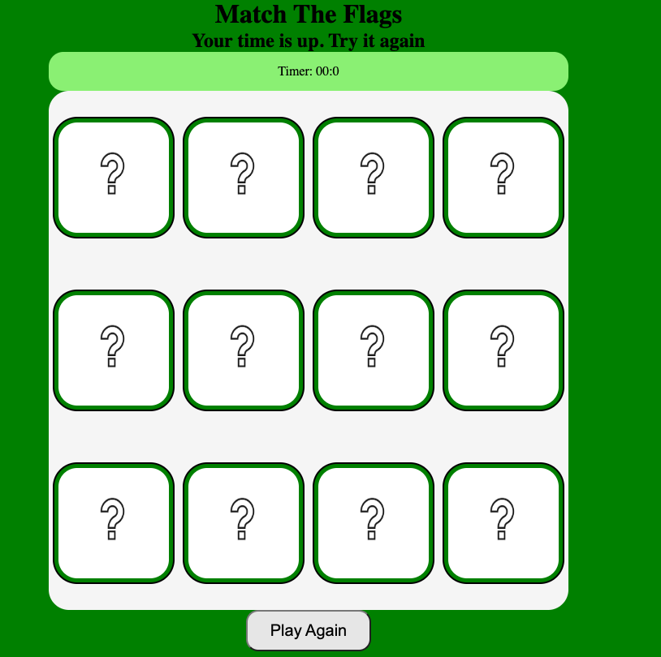

# Match-the-Flags

## Overview: 

---

This game is a Flag Matching & Memory Game.

The goal of the game is to find and pair six different country flags. To begin the game, click start. After clicking start, you will have 40 seconds and unlimited clicks to find all the pairs in order to win.

Visually, the game begins with 12 cards that each show a question mark on the back. Once you click one of the cards, it will turn around and a flag will show. Then, you will need to click on an additional card to find its match. If you do not match the flags, they will flip back to the question mark side. Once you find a matched pair, those cards will stay flipped towards the flag side.

This game will test your memory and help you to get to know some of the flags around our planet.

---

## Screenshot(s):

---
## Technologies Used:
* HTML5
* CSS3
* JavaScript

---
## Getting Started:
https://mariareeves.github.io/Memory-Game/

---

### Icebox:
* Upon game start, briefly display all flags before flipping back to the question mark side.
* Show a move counter next to the timer. 
* Restyle the wireframe.

---
### References:
* MDN
* W3Schools
* Code Sketch: https://www.youtube.com/watch?v=eMhiMsEC9Uk&list=PLLX1I3KXZ-YH-woTgiCfONMya39-Ty8qw&index=2 

